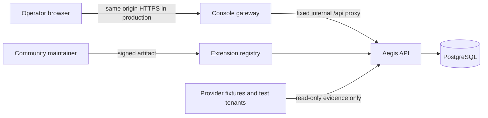

# Aegis threat model

This is our public, implementation-aligned threat model for a self-hosted
Aegis Compose deployment. We use STRIDE for design review and map API checks
to the [OWASP API Security Top 10 2023](https://owasp.org/API-Security/editions/2023/en/0x11-t10/)
and [OWASP ASVS 5.0](https://owasp.org/www-project-application-security-verification-standard/).
It is a security-engineering baseline, not a claim of certification or a
substitute for your deployment-specific assessment.

## System and trust boundaries

The console gateway is our browser boundary. It serves static assets, proxies
only the fixed `/api/*` path to the internal API service, applies a strict
same-origin CSP, and does not accept a user-controlled upstream URL.
PostgreSQL has no host port in the default Compose deployment. The API port is
loopback-only for local automation; put the console behind TLS and keep the API
network-private in production.

## Assets

- Access graph facts, review decisions, evidence bundles, audit records, and
  tenant-scoped workflow/action state.
- The deployment `MASTER_KEY` and encrypted provider credential material.
- Signed extension artifacts, provenance metadata, fixture certification, and
  maintainer identity.
- Console session context provided by the operator's surrounding deployment.

## Threats, controls, and residual risk

| Area                   | Threat                                                                                    | Current controls                                                                                                                     | Residual risk / operator requirement                                                                                                                                                                          |
| ---------------------- | ----------------------------------------------------------------------------------------- | ------------------------------------------------------------------------------------------------------------------------------------ | ------------------------------------------------------------------------------------------------------------------------------------------------------------------------------------------------------------- |
| Spoofing               | Unauthenticated caller reaches a control-plane route                                      | Loopback API exposure in Compose; same-origin gateway                                                                                | Aegis does **not** yet implement application authentication or authorization. Deploy behind an identity-aware reverse proxy and restrict network access before exposing it beyond a trusted operator network. |
| Tampering              | Modified community extension or provider-write capability                                 | Canonical digest/signature verification, protocol/platform governance, read-only method certification                                | Maintainers and signing keys remain a supply-chain trust boundary. Rotate or revoke compromised keys operationally.                                                                                           |
| Repudiation            | A decision or mock action lacks provenance                                                | Append-only audit records, source references, approval separation, provider-mutation false assertions                                | Audit retention, backup, and access controls are deployment responsibilities.                                                                                                                                 |
| Information disclosure | Credentials, provider URLs, or untrusted nested facts appear in assistance/catalog output | Credential host separation, source-fact whitelist/redaction, no-store API responses, nosniff/referrer/frame headers                  | Logs, backups, and database administrators are in scope for the host environment.                                                                                                                             |
| Denial of service      | Oversized body, expensive request, or dynamic CORS origin exhausts resources              | Explicit 1 MiB API/gateway body limits, fixed CORS-free same-origin gateway, bounded local assistance budget                         | There is no distributed rate limit or tenant quota yet; place a rate-limiting proxy in front of public deployments.                                                                                           |
| Elevation of privilege | Self-approval, bypassed lifecycle, or live provider action                                | Distinct routed reviewer, state-machine checks, test-tenant activation, certified mock-provider allowlist, `providerMutation: false` | The project intentionally has no live provider mutation. Any future adapter needs a new threat-model review and explicit operator controls.                                                                   |
| SSRF                   | User-controlled URL causes the service to reach internal resources                        | No arbitrary provider URLs in console assistance/CSV migration; console proxy has a fixed API target                                 | Future networked connectors must use allowlists, egress controls, and SSRF-specific tests before release.                                                                                                     |
| Misconfiguration       | Browser embedding, stale caches, exposed database, or permissive origins                  | CSP, frame denial, no-store API responses, loopback host ports, private database port, health-gated Compose startup                  | TLS termination, reverse-proxy authentication, secret rotation, and environment hardening remain mandatory deployment work.                                                                                   |

## Verification mapping

Our Playwright suite in `apps/e2e` verifies the deployed stack rather than an
in-memory substitute. It covers OWASP API1/API3 tenant and property isolation,
API4 resource limits, API5 approval boundaries, API6 lifecycle-flow abuse,
API7 fixed-target proxy behavior, API8 browser/deployment headers, API9 route
surface smoke checks, and API10 untrusted nested source facts. It also maps to
ASVS 5.0 requirements for threat modeling, input handling, output handling,
and browser security headers.

## Out of scope and review triggers

This model does not cover production identity providers, live provider writes,
internet-facing rate limiting, managed database operations, or your specific
network. Revisit it before adding authentication, any credential intake path,
a new connector transport, a provider mutation, a public SaaS deployment, or a
new browser origin.
